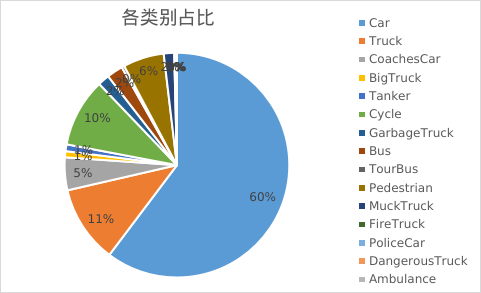
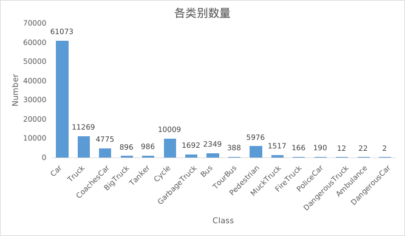

- [文件结构说明](#文件结构说明)
- [开始](#开始)
- [数据集信息](#数据集信息)
- [其他](#其他)
  - [获取数据集信息](#获取数据集信息)
  - [将某一个类别的标注信息写到图片中](#将某一个类别的标注信息写到图片中)
  - [类别数量筛选](#类别数量筛选)
  - [类别合并](#类别合并)

# 文件结构说明

数据集文件结构
```
./foxmail_object_detections_datasets
├── all
├── tools
│   ├── special_site_2d_220801
│   ├── configs
│   ├── readme.assets
│   └── utils
├── train
│   ├── special_site_jiaolian
│   ├── train_info
│   ├── voc_2007_2012_Pedestrain
│   └── VOCdevkitszcity1_specialcar_sub1
└── val
    ├── special_site_2d_220801_sub2
    ├── special_site_jiaolian
    ├── site1_special
    ├── task_special-2021_09_27_13_45_46
    ├── test_info
    └── VOCdevkitszcity1_specialcar_sub2

```
每个子数据的文件结构如下（如 `special_site_jiaolian`）：

```
./special_site_jiaolian/
    |-- 2007_test.txt
    |-- 2007_train.txt
    |-- 2007_val.txt
    |--VOC2007/
    |    |-- Annotations
    |    |   `-- *.xml
    |    |-- ImageSets
    |    |   `-- Main
    |    |       `-- default.txt
    |    |-- JPEGImages
    |    |    `-- *.jpg     
    |    |-- labels
    |         `-- *.txt
    |-- generatetxt.py
    |-- rename.py
    |-- train.all.txt
    |-- train.txt    
    `-- voc_label.py

```

在 ultralytics 训练过程中，直接调用 `VOC2007/JPEGImages/` 图片地址，并程序匹配到 `VOC2007/labels/` 训练标签


# 开始

**原始文件结构**

```
./special_site_jiaolian
    |-- Annotations
    |   `-- special
    |       `-- special
    |           `-- *.xml
    |-- ImageSets
    |   `-- Main
    |       `-- default.txt
    |-- JPEGImages
    |    `-- special
    |        `-- special
    |           `-- *.jpg     
    `-- labelmap.txt    

```
首先将对应的数据集拷贝到对应的位置，训练集拷贝到 `train` 目录下，用于验证的则拷贝到 `val` 目录下。之后，进行单个子数据集的构建，具体如下

1、对文件重命名，并更改文件结构  <br>
   注：如果文件结构满足**训练时候的文件结构**，直接跳到步骤 3 

```
python rename.py
```

2、创建文件夹 VOC2007,并将所有文件移动到 VOC2007 目录留下

```
./special_site_jiaolian
    |--VOC2007/
    |    |-- Annotations
    |    |   `-- *.xml
    |    |-- ImageSets
    |    |   `-- Main
    |    |       `-- default.txt
    |    |-- JPEGImages
    |    |    `-- *.jpg     
    |    `-- labelmap.txt  
    |-- generatetxt.py
    |-- rename.py
    `-- voc_label.py
```

3、生成训练、测试label地址

```
python generatetxt.py
```

生成的结果见

> ./special_site_jiaolian/VOC2007/ImageSets/Main

生成文件：

```
VOC2007/ImageSets/Main
                ├── test.txt
                ├── train.txt
                ├── trainval.txt
                └── val.txt
trainVal.py
```

4、生成训练的label.txt文件   
   修改训练的label，生成训练的标称文件
   修改 voc_label.py 中的 classes 变量

```
classes = ['Ambulance',
 'BigTruck',
 'Bus',
 'Car',
 'CoachesCar',
 'Cycle',
 'DangerousCar',
 'DangerousTruck',
 'FireTruck',
 'GarbageTruck',
 'MuckTruck',
 'Pedestrian',
 'PoliceCar',
 'Tanker',
 'TourBus',
 'Truck']
```

如果不知道标签有哪些，见 [获取数据集信息](#获取数据集信息)

```
python voc_label.py  
```


生成文件：

```
2007_test.txt
2007_train.txt
2007_val.txt
train.all.txt
train.txt
clscountdict.py	# 各个类别的数量
```


最终的目录结构如下：

```
./special_site_jiaolian
    |-- 2007_test.txt
    |-- 2007_train.txt
    |-- 2007_val.txt
    |--VOC2007/
    |    |-- Annotations
    |    |   `-- *.xml
    |    |-- ImageSets
    |    |   `-- Main
    |    |       `-- default.txt
    |    |-- JPEGImages
    |    |    `-- *.jpg     
    |    |-- labels
    |         `-- *.txt
    |-- generatetxt.py
    |-- rename.py
    |-- train.all.txt
    |-- train.txt    
    `-- voc_label.py

```

# 数据集信息


| 序号           | 名称           | 标签数量 | 占比   |
| -------------- | -------------- | -------- | ------ |
| 1              | Car            | 61073    | 60.28% |
| 2              | Truck          | 11269    | 11.12% |
| 3              | CoachesCar     | 4775     | 4.71%  |
| 4              | BigTruck       | 896      | 0.88%  |
| 5              | Tanker         | 986      | 0.97%  |
| 6              | Cycle          | 10009    | 9.88%  |
| 7              | GarbageTruck   | 1692     | 1.67%  |
| 8              | Bus            | 2349     | 2.32%  |
| 9              | TourBus        | 388      | 0.38%  |
| 10             | Pedestrian     | 5976     | 5.90%  |
| 11             | MuckTruck      | 1517     | 1.50%  |
| 12             | FireTruck      | 166      | 0.16%  |
| 13             | PoliceCar      | 190      | 0.19%  |
| 14             | DangerousTruck | 12       | 0.01%  |
| 15             | Ambulance      | 22       | 0.02%  |
| 16             | DangerousCar   | 2        | 0.00%  |
| **总标签数量** | **101322**     |          |        |
| **图片数量**   | **11500**      |          |        |








标签与数据集数量

```
#"label informations"
labels = [
'Ambulance', 
'BigTruck', 
'Bus', 
'Car', 
'CoachesCar', 
'Cycle', 
'DangerousCar', 
'DangerousTruck', 
'FireTruck', 
'GarbageTruck', 
'MuckTruck', 
'Pedestrian', 
'PoliceCar', 
'Tanker', 
'TourBus', 
'Truck']
nums = 16
#"xml file nums"
xml_file_nums = 11500
```


各个 labels 的数量

```
clscountdict={
'Car': 61073, 
'Truck': 11269, 
'CoachesCar': 4775, 
'BigTruck': 896, 
'Tanker': 986, 
'Cycle': 10009, 
'GarbageTruck': 1692, 
'Bus': 2349, 
'TourBus': 388, 
'Pedestrian': 5976, 
'MuckTruck': 1517, 
'FireTruck': 166, 
'PoliceCar': 190, 
'DangerousTruck': 12, 
'Ambulance': 22, 
'DangerousCar': 2}

```


# 其他

## 获取数据集信息

用于获取

- 标签类型名称统计
- 标签数量
- 训练标签数量

1、运行

```
python get_label_from_xml.py
```

2、结果

结果见文件

```
xml_labels.py
```


## 将某一个类别的标注信息写到图片中

需要在图片中显示标注框信息

1、修改  `Write_imgs_labels` 类中的` self.select_classes`

```
        self.select_classes=[
        'Ambulance', 
        'BigTruck', 
        'Bus', 
        'Car', 
        'CarGroup', 
        'Cycle', 
        'DangerousTruck', 
        'FireTruck', 
        'Guardrail', 
        'Pedestrian', 
        'PoliceCar', 
        'Tanker', 
        'TourBus', 
        'Trafficlight', 
        'Trafficsigns', 
        'Truck']
```

2、运行

```
python write_labels_to_imgs.py
```

3、查看结果

结果见文件夹 `output/`


## 类别数量筛选

用于调整数据集比例，制作训练集、测试集

文件：select_class_move.py

1、修改类别比例

修改需要调整的比例，并将对应的图片、标签txt、标签 xml 进行移动


```
        self.select_classes={
                    'BigTruck': 0.3, 
                    'GarbageTruck': 0.3, 
                    'MuckTruck': 0.3, 
                    'Truck': 0.1,
            } # 类别，选中的数量比例
```

2、运行

```
python  select_class_move.py

```


3、查看实际的操作信息

见生成的文件 `move_info.py`

如：

```
'''
Author: xuarehere
Date: 2023-01-06 17:15:40
LastEditTime: 2023-01-06 17:17:28
LastEditors: xuarehere
Description: 
FilePath: /special_site_jiaolian/move_info.py

'''
#"set information"	# 设置信息
select_classes = {'BigTruck': 0.3, 'GarbageTruck': 0.3, 'MuckTruck': 0.3, 'Truck': 0.1}
select_classes_nums = {'BigTruck': 268, 'GarbageTruck': 507, 'MuckTruck': 455, 'Truck': 1126}

#"actually move information" # 实际操作的信息
move_nums = {'Ambulance': 3, 'BigTruck': 270, 'Bus': 255, 'Car': 8687, 'CoachesCar': 311, 'Cycle': 1510, 'DangerousCar': 0, 'DangerousTruck': 1, 'FireTruck': 11, 'GarbageTruck': 508, 'MuckTruck': 455, 'Pedestrian': 840, 'PoliceCar': 21, 'Tanker': 97, 'TourBus': 36, 'Truck': 1736}

```


被筛选的结果，移动到`output_selected/`


## 类别合并


1、修改合并参数

修改配置文件

```
configs/merge_labels.yaml
```

参数信息如下：

```configs/merge_labels.yaml
BASE:
  # 图片地址
  path: ["./VOC2007/JPEGImages",
         ]
  # 被丢弃的信息，储存地址。如：图片中的所有的label都不在合并的类型中，因此丢弃       
  save_dir: "./tmp/"             
OLD:
  old_labels: ['Ambulance', 
                'BigTruck', 
                'Bus', 
                'Car', 
                'CoachesCar', 
                'Cycle', 
                'DangerousCar', 
                'DangerousTruck', 
                'FireTruck', 
                'GarbageTruck', 
                'MuckTruck', 
                'Pedestrian', 
                'PoliceCar', 
                'Tanker', 
                'TourBus', 
                'Truck']  # 原来的类别

NEW:
  new_labels: ["Bus",
                "Car" ,
                "Cycle" , 
                "Pedestrian" , 
                "Truck",
                "BigTruck",
                "Tanker",
                "GarbageTruck",
                "MuckTruck",
                "CoachesCar",]   # 新的类别，不在这里面就被抛弃
  merge_labels: {
              "Bus": ["TourBus",  ],
              "Car": ["PoliceCar", "Ambulance","TestCar", "OfficialCar", "DangerousCar", ],
              "Cycle": [], 
              "Pedestrian": [], 
              "Truck": ["DangerousTruck", "FireTruck", ],
              "BigTruck": [],
              "Tanker": [],
              "GarbageTruck":[],
              "MuckTruck": [],
              "CoachesCar": [],
          }                 # 合并的类别     

```


2、运行

```
python merge_labels.py
```


3、结果

文件夹 `tmp` 储存了丢弃的问题

标签修改结果，见 `VOC2007/labels`


